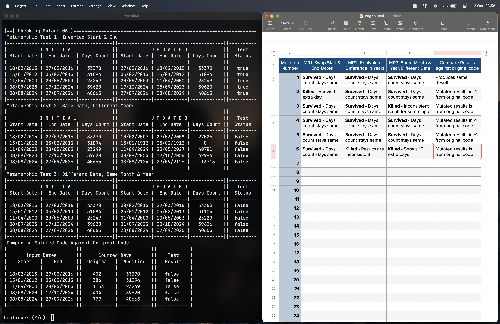

# Testing wy3148/dc

This repository is designed to test a [basic days calculator](https://github.com/wy3148/dc).
The testing methodology employed includes Mutation Testing using Metamorphic Relations.

This project is part of the SWE30009 - Testing & Reliability unit.

The project directory `cmd/` contains the test code, which includes table print
functions, as well as testgroup data structures and arrays. The `mutants/` directory
features modified source code with **case statements** that allow for dynamic
activation of mutants, eliminating the need for 30 separate copies of the source
code. While I have also created 30 individual copies of the program, each
containing a single mutant (to meet submission requirements), the implementation
in this code is equally valid and generates same result. It just uses `switch`
to activate different mutations, instead of relying on 30-copies of the same
project.

